# Dynamic Engine Workbench
#### Apache Cordova Development Environment for ATOM

Current version: Developer Preview (Rel. 0.1.0)

### New Project Panel
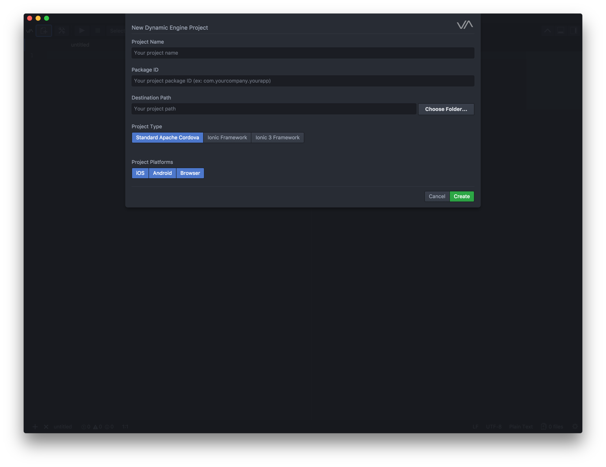

### Main Toolbar
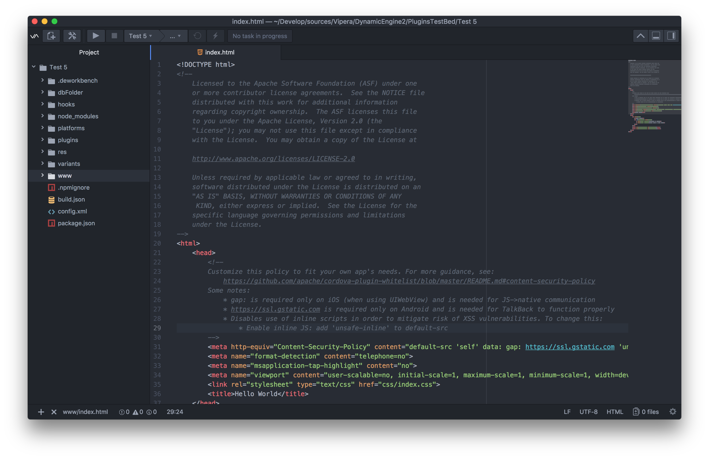

### Task Manager
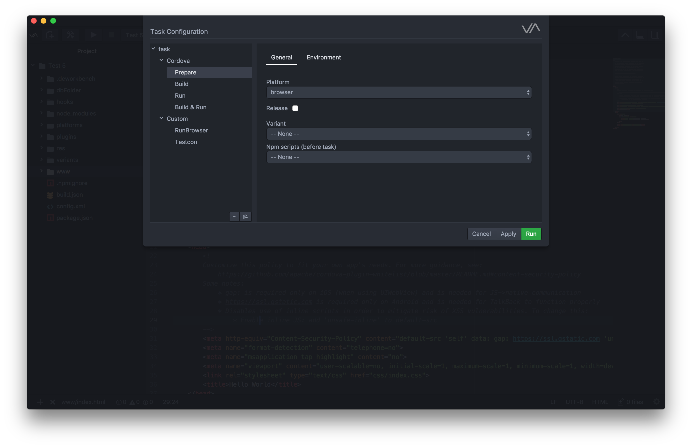

### Run App Task

### Custom Tasks
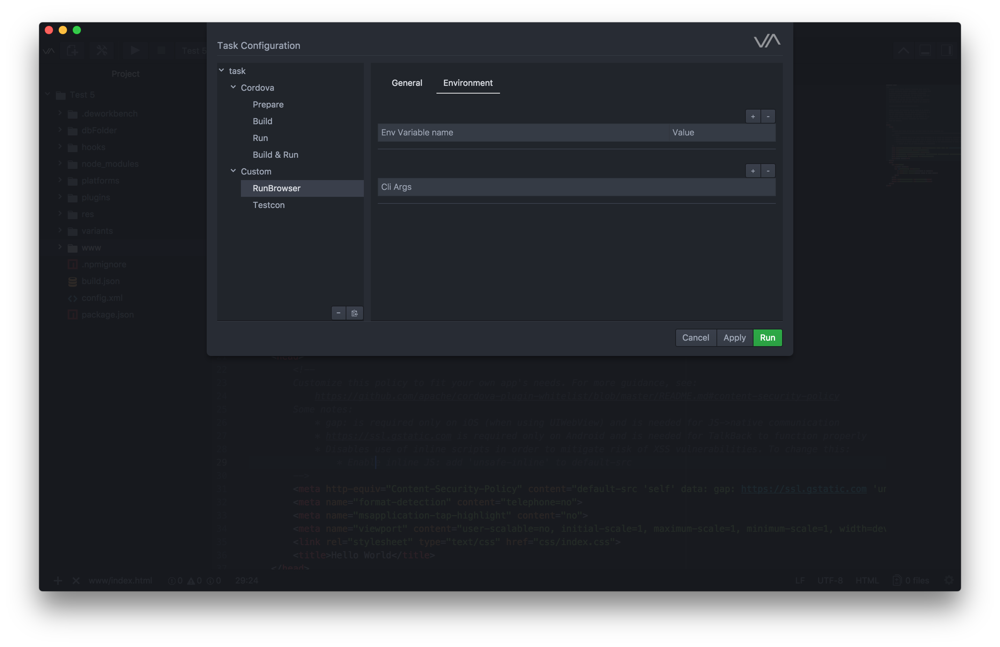

### Project Settings
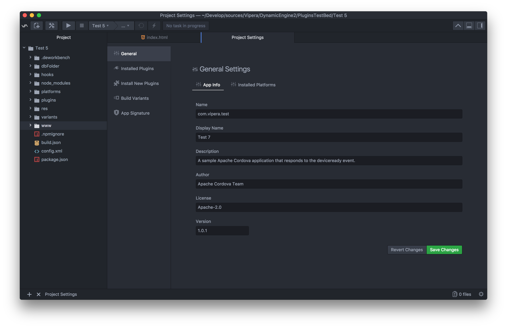

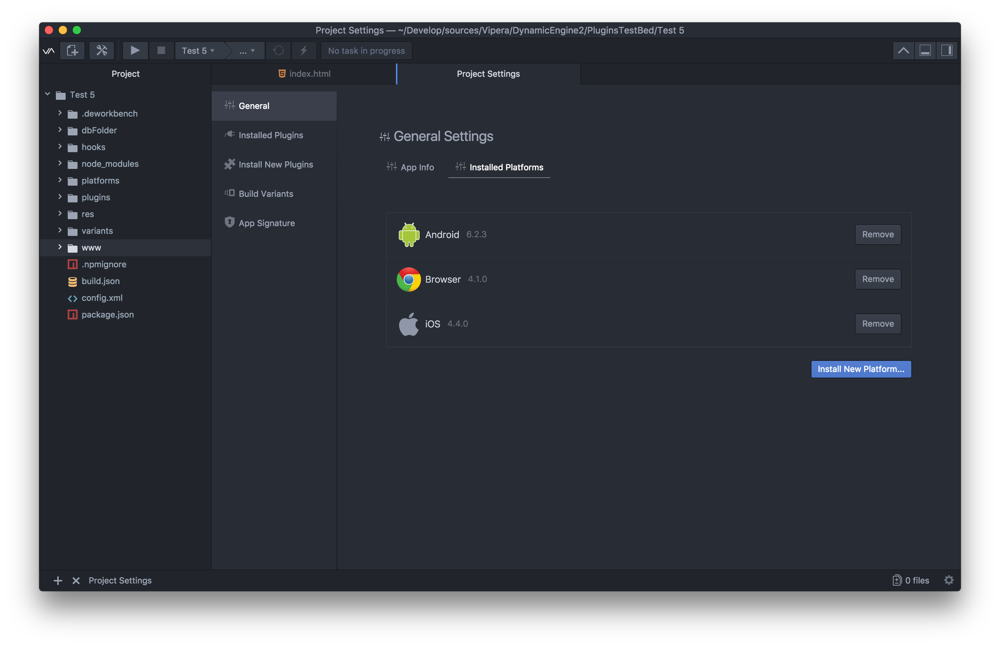

### Search and Install Plugins
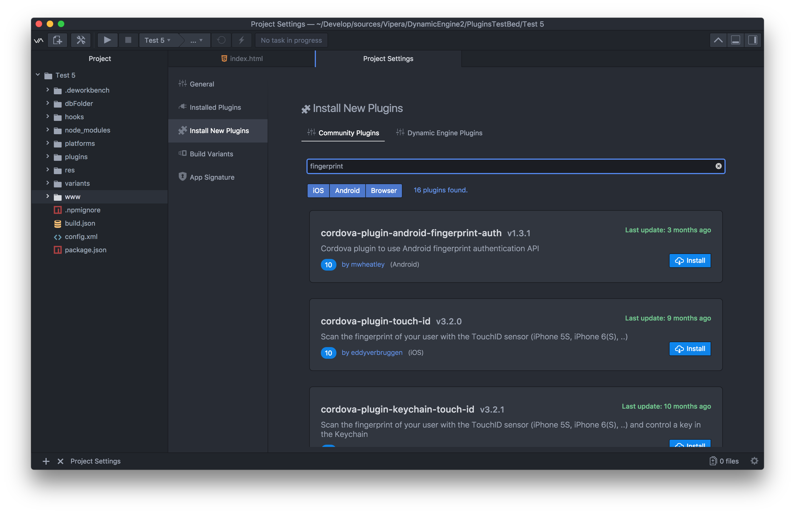

### Manage installed Plugins
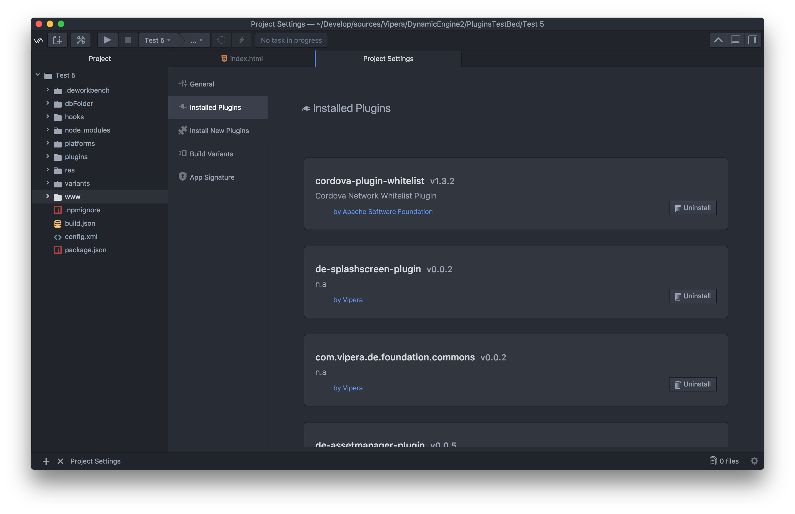

### Manage installed Plugins

### Build Variants
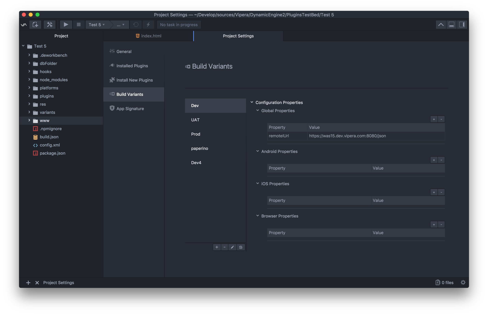

### Log View

### App Signature
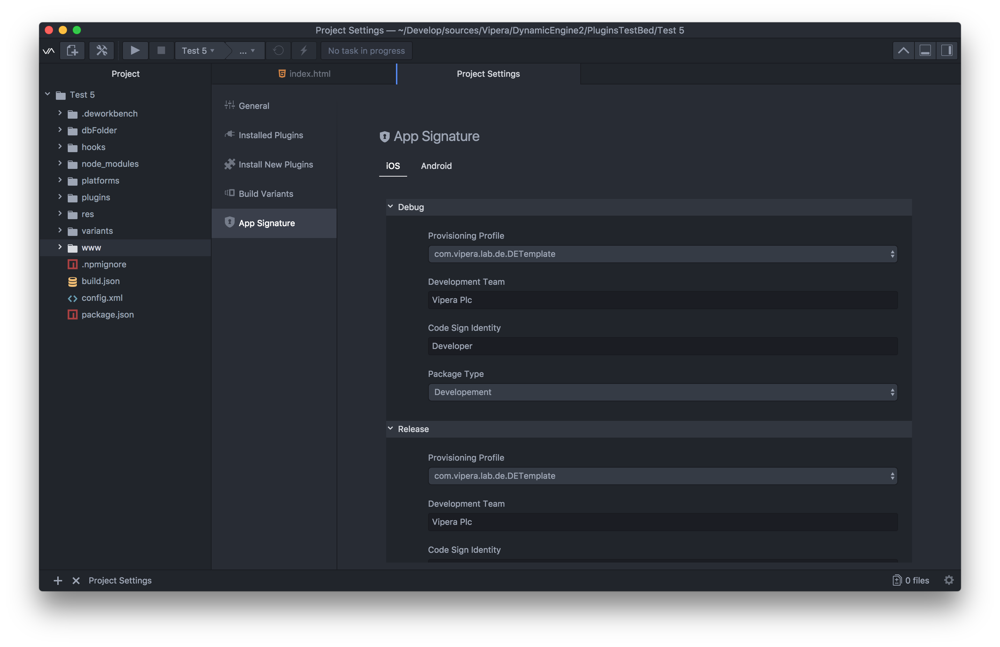

### Bookmarks
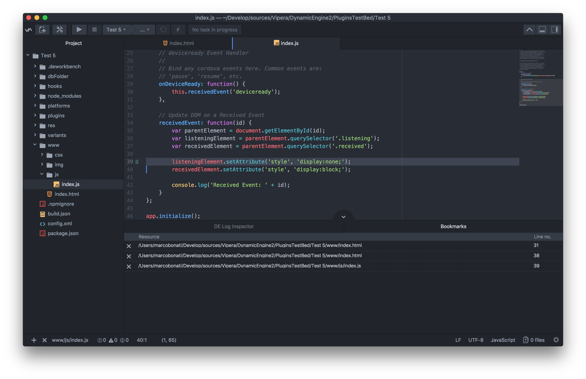

Develop Build

Master Build

