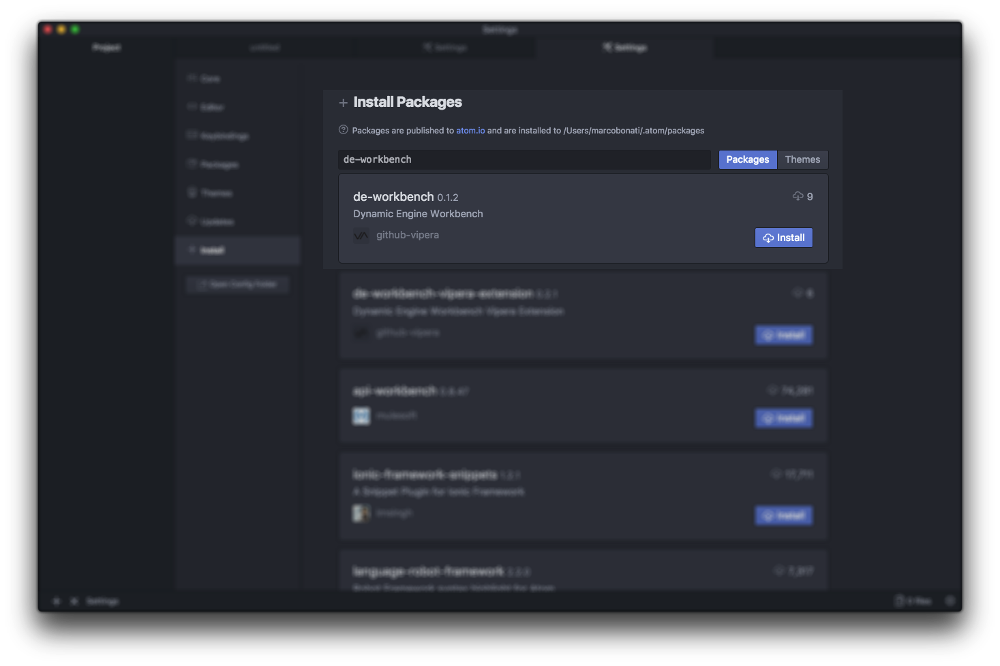
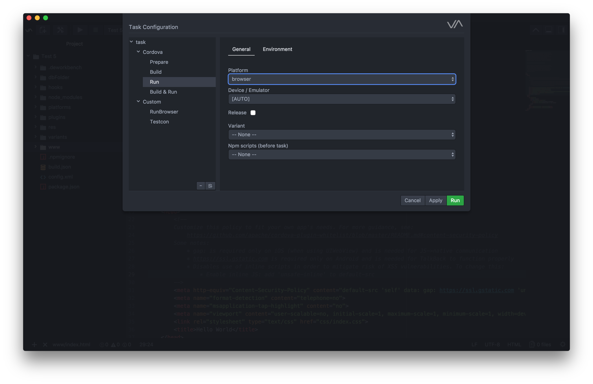
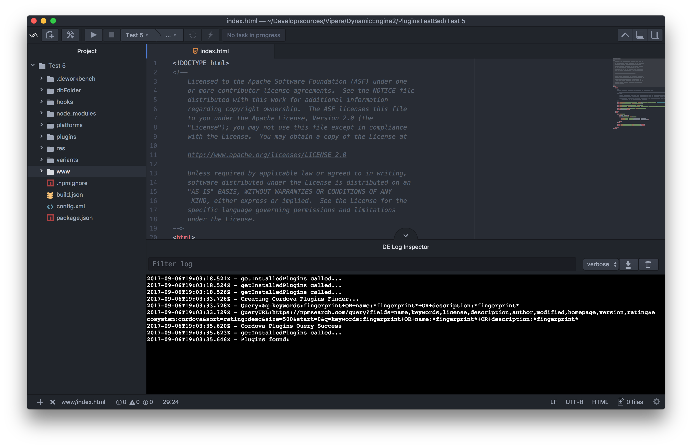

# Dynamic Engine Workbench
#### Apache Cordova Development Environment for ATOM

Current version: Developer Preview (Rel. 0.1.0)

Develop Build

Master Build

### Installation

#### 1 - Atom
- [Download](https://atom.io) and install official GitHub’s Atom text editor. The Dynamic Engine Workbench IDE is built on top of it

- **Open** Atom Package Manager

    + *Mac OS X*, ``Menu: Atom > Preferences > Install``
    + *Windows*, ``Menu: File > Settings > Install``
    + *Linux*, ``Menu: Edit > Preferences > Install``

- **Search** for official ``de-workbench`` `package <https://atom.io/packages/de-workbench>`_

- **Install** Dynamic Engine Workbench.

---

### New Project Panel

### Main Toolbar

### Task Manager

### Run App Task

### Custom Tasks

### Project Settings

### Search and Install Plugins

### Manage installed Plugins

### Build Variants

### Log View

### App Signature

### Bookmarks

